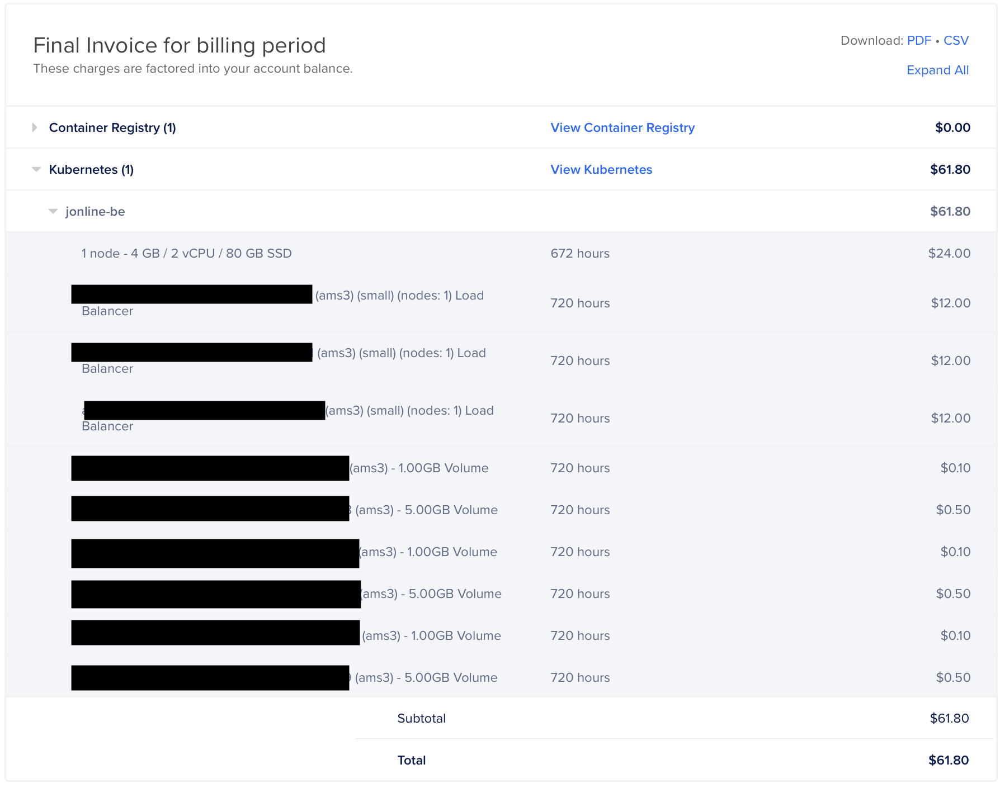

# Jonline [](https://github.com/jonlatane/jonline/actions/workflows/deploy_server.yml) 
Jonline is an open-source, community-scale social network designed to be capable of "federating" with other Jonline instances/communities, making sharing between local-size instances easy. All web-facing features in Jonline - the Tamagui/React app, the Flutter app, and Media endpoints - use localStorage (or system storage, for native Flutter apps) and neither set nor read cookies at all.

The "dev" instance is up at [Jonline.io](https://jonline.io) (the Flutter app being at [Jonline.io/flutter](https://jonline.io/flutter)). Two "production" instances are also at [BullCity.Social](https://bullcity.social) and [OakCity.Social](https://oakcity.social). Unless I'm doing some testing with Jonline.io, all three should be configured to be able to federate with one another (or, for clients to federate between them). For anyone curious, all three (along with their corresponding Postgres and MinIO) live on a single-box DigitalOcean K8s instance. Between the 3 Load Balancers, storage, and compute resources, it costs about $60 to run the 3 domains. (All also keep their media and HTML/CSS/JS behind CloudFlare's free CDN.)

[](https://account.venmo.com/u/Jon-Latane)

## Deployments

[](https://hub.docker.com/r/jonlatane/jonline/tags) [](https://hub.docker.com/r/jonlatane/jonline_preview_generator/tags)

| Deployment                                                                                    | Purpose                          | Links                                                                                                                                           |
| --------------------------------------------------------------------------------------------- | -------------------------------- | ----------------------------------------------------------------------------------------------------------------------------------------------- |
| [](https://jonline.io)                 | Flagship demo/informational site | [About](https://jonline.io/about), [Flutter UI](https://jonline.io/flutter/), [Protocol Docs](https://jonline.io/docs/protocol/)                |
| [](https://BullCity.Social/) | Durham, NC Community Page        | [About](https://BullCity.Social/about), [Flutter UI](https://BullCity.Social/flutter/), [Protocol Docs](https://BullCity.Social/docs/protocol/) |
| [](https://OakCity.Social/)    | Raleigh, NC Community Page       | [About](https://OakCity.Social/about), [Flutter UI](https://OakCity.Social/flutter/), [Protocol Docs](https://OakCity.Social/docs/protocol/)    |

| Platform | Workflow Status                                                                                                                                                                        | Stable Release | Beta Release                                             | Notes                                                                           |
|---| -------------------------------------------------------------------------------------------------------------------------------------------------------------------------------------- | -------------- | -------------------------------------------------------- | ------------------------------------------------------------------------------- |
| App Store (iOS, iPadOS) | [](https://github.com/jonlatane/jonline/actions/workflows/flutter_ios.yml) | N/A            | [TestFlight](https://testflight.apple.com/join/pIvX01w2) | Versions may not be current, subject to (Beta) App Review submission + approval |

- [Jonline ](#jonline-)
  - [Deployments](#deployments)
  - [What is Jonline?](#what-is-jonline)
    - [Why Jonline vs. Mastodon/OpenSocial?](#why-jonline-vs-mastodonopensocial)
      - [Jonline as a protocol vs. ActivityPub](#jonline-as-a-protocol-vs-activitypub)
    - [Cost of Operation](#cost-of-operation)
    - [Why *not* Jonline?](#why-not-jonline)
  - [Features Overview](#features-overview)
    - [Jonline Identifiers: Usernames, Group Names, and IDs](#jonline-identifiers-usernames-group-names-and-ids)
    - [People, Followers and Friends](#people-followers-and-friends)
    - [Groups and Memberships](#groups-and-memberships)
    - [Media](#media)
    - [Posts](#posts)
      - [GroupPost](#grouppost)
    - [Events](#events)
  - [Documentation](#documentation)
    - [Micro-Federation](#micro-federation)
    - [Protocol Documentation](#protocol-documentation)
    - [Project Components](#project-components)
      - [Documentation](#documentation-1)
      - [gRPC APIs](#grpc-apis)
      - [Deployment Management](#deployment-management)
        - [TLS Certificate Generation](#tls-certificate-generation)
      - [Rust Backend](#rust-backend)
      - [Frontends](#frontends)
        - [Web (Tamagui/React/Next.js) Frontend](#web-tamaguireactnextjs-frontend)
        - [Flutter Frontend](#flutter-frontend)
      - [CI/CD (Continuous Integration and Delivery)](#cicd-continuous-integration-and-delivery)
          - [CI For iOS, Android, macOS, Windows, and Linux](#ci-for-ios-android-macos-windows-and-linux)
  - [Quick deploy to your own cluster](#quick-deploy-to-your-own-cluster)
    - [Deploying to other namespaces](#deploying-to-other-namespaces)
    - [Validating your deployment](#validating-your-deployment)
      - [Kubernetes service statuses](#kubernetes-service-statuses)
      - [External IP Management](#external-ip-management)
    - [Pointing a domain at your deployment](#pointing-a-domain-at-your-deployment)
    - [Securing your deployment](#securing-your-deployment)
    - [Deleting your deployment](#deleting-your-deployment)
  - [Motivations](#motivations)
    - [Scaling Social Software via Micro-Federation](#scaling-social-software-via-micro-federation)
  - [Future features](#future-features)

## What is Jonline?
Jonline is a network of, and a protocol for, social networks. It aims to be something like [Plex](https://www.plex.tv/), but as a social network released under the [AGPL](https://fossa.com/blog/open-source-software-licenses-101-agpl-license/) (and also, Kubernetes/LetsEncrypt/CertManager-friendly). Use cases include:

* Neighborhoods, communities, or cities
* (Ex-)Coworkers wanting a private channel to chat
* Run/bike/etc. clubs
* App user groups
* Online game clans
* Board game groups
* D&D parties
* Local concert listings
* Event venue calendars

The core model of Jonline is that *each of these communities is run as its own Jonline instance*. Each of these instances and their data are literally *owned* by the organization (or a chosen "IT admin person" and/or "moderation team" for it). Finally, the same person's *accounts on all of these instances can be federated* (if the user chooses, and dependent upon server configurations and permissions, of course). Federation is simply a means to let, say, a user, Jeff, see their D&D DM also knows the guy from run club who left his wallet, *even if Jeff and the DM are not friends on the run club network*, but *only if the DM chooses* to federate their identity across both those networks.

One way to think of Jonline is as social media meets the email server model (I use Gmail, you use your ISP's email, we can still talk to each other), with a bit of the ListServ model too (it's *very* easy to set up a neighborhood Jonline instance, Posts function effectively identically to ListServ messages, and Events are basically just a nice extra feature ListServ doesn't have).

Another way to think of Jonline is that it's like Slack or Discord, except instead of messages/channels/voice chats, it's just for Posts and Events. And your Jonline instance is code you can actually see running on equipment you own, not proprietary code running on a corporation's servers.

A core goal is to make Jonline dogshit easy (🐕💩EZ) for anyone else to deploy to any Kubernetes provider of their choosing (and to fork and modify). It's also (optimistically) simple and straightforward enough to serve as a starter for many projects, so long as they retain the [AGPL license Jonline is released under](https://github.com/JonLatane/jonline/blob/main/LICENSE.md). All you need is a Kubernetes (k8s) cluster, `git`, `kubectl`, `make`, and a few minutes to get the [prebuilt image](https://hub.docker.com/repository/docker/jonlatane/jonline) up and running.

Why this goal for this project? The tl;dr is that it keeps our social media data decentralized and in the hands of people we at least kinda trust. See [Scaling Social Software via Federation](#scaling-social-software-via-federation) for more rants tho.

### Why Jonline vs. Mastodon/OpenSocial?
* Jonline's UI is hopefully designed to let users key into the federated features of the app much more easily.
* Jonline deploy scripts are designed to be so easy to deploy to Kubernetess you can be braindead and get it up and running for your website. Further, it's all just `Makefile`s and `kubectl` commands (though maybe that's a con for the reader 😁).
* Jonline's server images are structured so you only need one LoadBalancer (the things you typically pay for) per deploy/website, and really only one web-facing container (though it defaults to 2) per deploy.
    * Within the containers themselves, everything is handled by a single Rust BE binary. No scripting runtime. So containers are small, even with useful Linux tools like `psql` and `grpcurl` built in. They start *really fast*, and Kubernetes failovers work very smoothly.
    * And the Rust BE is, after all, Rust; it's *fast*.
* To be specific, at the time of this writing: [Jonline's Docker images are currently 105MB](https://hub.docker.com/r/jonlatane/jonline/tags), [Mastodon's are 500+MB](https://hub.docker.com/r/tootsuite/mastodon/tags), and [OpenSocial's are over 1GB](https://hub.docker.com/r/goalgorilla/open_social_docker/tags).
* The new Tamagui FE is also demonstrably lightweight.
* A major feature I *hope* to differentiate on is Events, but it's not done yet.

The goal of all this is to make it as easy as possible for local businesses to:
* Engage with customers on a platform customers enjoy.
* Use Jonline to share information about customers between each other, in a way customers can easily understand and consent to, without a central corporation being involved.
    * Example: make it easy for Kathy to share her band's show with the folks at her yoga studio, by cross-posting it to her yoga studio profile

#### Jonline as a protocol vs. ActivityPub
Jonline is also a protocol, much like ActivityPub. It's worth skimming both the [ActivityPub Protocol Docs](https://www.w3.org/TR/activitypub/) and the [Jonline Protocol Docs](https://jonline.io/docs/protocol), but this is a brief breakdown.

Notably, while ActivityPub specifies a server-to-server federation protocol, Jonline simply lets servers "recommend" other servers by hostname, with the "federation" done on the client side by communicating with the recommended servers based on user authorization. (Yes, this could barely defined as "federation" at all - but it's cheaper and effectively the same to users. The Jonline protocol simply calls this [Micro-Federation](https://jonline.io/docs/protocol#micro-federation).)

While ActivityPub is defined using HTTP(S) and JSON, Jonline is defined with gRPC (on port 27707, with optional TLS), using HTTP(S) for media and CDN-based host negotiation only (no JSON, anywhere). Broadly speaking, Jonline may be called "more opinionated" than ActivityPub as a social networking protocol, and covers more things than just social activity (including things like user-facing server configuration data, privacy policy, etc.).

Whereas ActivityPub has a flexible Activity model capable of holding varied metadata, Jonline's API definitions deliberately avoid allowing for metadata, and focus on statically-typed, specific models for Posts and Events. The Jonline data model is designed using composition, with Events' titles, descriptions, moderation, etc. belonging to a Post owned by them, over inheritance (i.e. making Event "extend" Post in OOP). Jonline leverages this to implement visibility and moderation controls for Posts and Events across the system all in one place.

In addition to Users, Posts, and Events, which could all be "described" by ActivityPub's specification, Jonline also has Media (designed to leverage external CDNs), Groups, Server Configuration, and moderation/visibility/permission management across everything as a first-class citizen.

The hope is to build more useful business objects - yes, your boring SalesForce/NetSuite/SAP type stuff - into this social protocol. So Jonline Payments, Products, Subscriptions, and who knows what else could, eventually, be gradually implemented atop the Jonline protocol, with all the same clear, concise, documentation, cross-language portability, and other benefits it offers.

All this is to say: it should be pretty straightforward to create, say, Ruby bindings for Jonline, and use them in Mastodon to make it work as a no-Events-support, no-Media-support Jonline instance. Or vice versa. This is back burner research, though. Get in contact if you're interested in contributing/learning to do this type of work!

### Cost of Operation

**November 2023 Server Costs:** (3 instances)


### Why *not* Jonline?
* It's not done.
* There's near-0% test coverage.
* It's just my own (Jon) thing I'm doing in my spare time. 
* There's no community for ongoing support yet. It's just me, Jon 🙃 But do get in contact if you're trying to use this!

## Features Overview
All of Jonline's features should be pretty familiar to most social media users. Notably, in both its web and Flutter UIs, Jonline is designed to present "My Media" as a top-level feature and let users delete and manage Media visibility independently of Posts, Events, Groups or anything else.

### Jonline Identifiers: Usernames, Group Names, and IDs
A key point of contention in the Fediverse is the notion of universal usernames and IDs. Jonline also supports Groups and Group Names (which work much like subreddits or Facebook groups). There's a lot of complex implementations around this in Mastodon and elsewhere. Since Jonline's protocols do not specify anything about server-to-server communication, none of that stuff is really necessary in the Jonline approach at all! At a high level, Jonline Usernames, Group Names, and IDs look like a mix between URLs and email addresses. An important feature of both Jonline Usernames and IDs is that they do not change when URL-encoded.

For instance: I can claim [jonline.io/jon](https://jonline.io/jon), [bullcity.social/jon](https://bullcity.social/jon), and [oakcity.social/jon](https://oakcity.social/jon) for myself. But if you decide to start an instance at [febreze.lol/jon](https://febreze.lol/jon) and I want to make an account and share with you (I absolutely would!), I'll just have to register as [febreze.lol/jonline-jon](https://febreze.lol/jonline-jon) or my username of choice to interact on there. (But, in the future, I will be able to interlink all 4 of these profiles to make them appear as verified alternate identities across the servers!)

**Jonline Usernames** are, essentially, a link to a profile. Jonline gives the top-level resource names to users; i.e., user `bob123` on [jonline.io](https://jonline.io) can be found at [jonline.io/bob123](https://jonline.io/bob123). Users can change their usernames, but User IDs are permanent (unless the server administration changes the ID offset; see below for details.) [The few usernames you can't use on Jonline are enumerated in this Rust source.](https://github.com/JonLatane/jonline/blob/main/backend/src/rpcs/validations/validate_fields.rs)

Example Jonline usernames:

* [jonline.io/jon](https://jonline.io/jon): A user on [jonline.io](https://jonline.io).
* [bullcity.social/jon](https://bullcity.social/jon): A user on [bullcity.social](https://bullcity.social).
* [jonline.io/jon@bullcity.social](https://jonline.io/jon@bullcity.social): A view of [bullcity.social/jon](https://bullcity.social/jon) when using [jonline.io](https://jonline.io). (Note that [bullcity.social](https://bullcity.social) must permit [jonline.io](https://jonline.io) via CORS for loading to work.)

**Jonline Group Names** work much like usernames, but for groups. They are automatically derived from the actual group name (they are the field `Group.shortname`, derived from `Group.name` by removing non-word characters).

Example Jonline Group Names:

* [jonline.io/g/Fitness](https://jonline.io/g/Fitness): A group on [jonline.io](https://jonline.io).
* [bullcity.social/g/Running](https://bullcity.social/g/Running): A group on [bullcity.social](https://bullcity.social).
* [jonline.io/g/Running@bullcity.social](https://jonline.io/g/Running@bullcity.social) - a view of [bullcity.social/g/Running](https://bullcity.social/g/Running) when using [jonline.io](https://jonline.io). (Note that [bullcity.social](https://bullcity.social) must permit [jonline.io](https://jonline.io) via CORS for loading to work.)

**Jonline IDs** are numerical IDs for any entity type on a server. We might say: *in the context of Jonline.io*, Post ID `T6S8eoDmmtb` would be expected to be found at [jonline.io/post/T6S8eoDmmtb](https://jonline.io/post/T6S8eoDmmtb). (Note that the numerical portion of the ID is literally just a 64-bit integer encoded with base58 and a server-configurable offset. The best reference for how "Jonline ID Marshaling" works would be [these <90 lines, including test coverage, of Rust code.](https://github.com/JonLatane/jonline/blob/main/backend/src/marshaling/id_marshaling.rs))

Example Jonline IDs:

* [jonline.io/post/T6S8eoDmmtb](https://jonline.io/post/T6S8eoDmmtb): A Post on [jonline.io](https://jonline.io).
* [bullcity.social/post/2g1j95Bw5gB](https://bullcity.social/post/2g1j95Bw5gB): A Post on [bullcity.social](https://bullcity.social).
* [jonline.io/post/2g1j95Bw5gB@bullcity.social](https://jonline.io/post/T6S8eoDmmtb): A view of [bullcity.social/post/2g1j95Bw5gB](https://bullcity.social/post/2g1j95Bw5gB) when using [jonline.io](https://jonline.io). (Note that [bullcity.social](https://bullcity.social) must permit [jonline.io](https://jonline.io) via CORS for loading to work.)
* [bullcity.social/event/4rAfoSKAuJo](https://bullcity.social/event/4rAfoSKAuJo): An Event on [bullcity.social](https://bullcity.social).
* [jonline.io/event/4rAfoSKAuJo@bullcity.social](https://jonline.io/event/4rAfoSKAuJo@bullcity.social) - a view of [bullcity.social/event/4rAfoSKAuJo](https://bullcity.social/event/4rAfoSKAuJo) when using [jonline.io](https://jonline.io). (Note that [bullcity.social](https://bullcity.social) must permit [jonline.io](https://jonline.io) via CORS for loading to work.)

### People, Followers and Friends
Jonline allows users to create accounts and login with nothing but a username/password combo. Anyone can Follow anyone, but users can require approval for Follow Requests. Two users who Follow each other are Friends.

### Groups and Memberships
Jonline supports Groups, which are much like Usenet groups, Facebook groups, or subreddits.

### Media
Jonline `Media` is straightforwardly built on content-types and blob storage. It's the reason Jonline requires S3/MinIO. Unlike `Post`s and `Event`s, `Media` is generally not shared directly. It is instead associated with `Post`s and `Event`s (for media listings) as well as Users and Groups (for their avatars).

Media is the *only* part of Jonline's APIs offered over HTTP as well as gRPC/gRPC-over-HTTP. (Hopefully the reasons for this are obvious: easy browser streaming and cache utilization for things like images.) Details on the HTTP Media APIs are in the ["Media" section](https://github.com/JonLatane/jonline/blob/main/docs/protocol.md#media) of the [protocol documentation](https://github.com/JonLatane/jonline/blob/main/docs/protocol.md).

All Media also carries `Visibility` and `Moderation` values that can be modified in the APIs, but are not currently enforced. Note that any Media visibility updates and/or deletions may take time to propagate fully, depending upon how a given Jonline instance's CDN setup works.

### Posts
`Post`s follow a Twitter- or Reddit- like model. They have a [`PostContext`](https://github.com/JonLatane/jonline/blob/main/docs/protocol.md#jonline-PostContext) as well as all-optional `title`, `link`, and `description` string values. A top-level post is stored generally the same as a reply. Posts also carry a `Visibility` and `Moderation` value that is enforced by the APIs.

Posts are also reused for Events, and will be similarly reused for future features. For developers: this is something like ActiveRecord Polymorphism, but using composition rather than inheritance at the ORM level. For users: Replies, Events, and other Jonline types track their title, description, visibility, moderation, etc. via a Post internally.

#### GroupPost
A key differentiator between `Post` and `Media` is that `Post`s and types that use them are "group-aware." That is to say: `GroupPost` exists, 
linking any unique `Group` to any unique `Post`, along with the `User` who created that link.

### Events
`Event`s are a thin layer atop `Post`s. Any Event has a single Post, as well as at least one EventInstance. An EventInstance has a start time, end time, location, and RSVP/attendance data. Group Events work through the `GroupPost` mechanism.

## Documentation
Jonline documentation consists of Markdown in the [`docs/` directory](https://github.com/JonLatane/jonline/tree/main/docs), starting from [`docs/README.md`](https://github.com/JonLatane/jonline/blob/main/docs/README.md).

### Micro-Federation
A key thing that separates Jonline from Mastodon and other Fediverse projects is that it *does not* support server-to-server communication. Essentially, the only server-to-server communication is via "recommended servers," which will eventually also let admins enable CORS to control where users can see content and user information from their servers.

This approach does not seek to be particular innovative or groundbreaking technologically. It simply aims to make it easier for people to use *existing* web standards to interact, share, plan, and play with each other, and make administrating a server simple enough that nearly anyone can do it. All you need to worry about as an administrator in this regard is a [list of servers like this](http://jonline.io/server/http%3Alocalhost?section=federation) - literally nothing but a list of hosts.

### Protocol Documentation
A benefit of being built with gRPC is that [Jonline's generated Markdown documentation is relatively easy to read and complete](https://github.com/JonLatane/jonline/blob/main/docs/protocol.md#jonline-Jonline). Jonline renders documentation as Markdown, and converts that Markdown to HTML with a separate tool. Jonline servers also always include a copy of their documentation (for example, [https://jonline.io/docs/protocol](https://jonline.io/docs/protocol)).

### Project Components
The following components are *literally* just a "nice to read" breakdown of the overall directory structure of this repository. Nonetheless, this should be a useful first pass for anyone hoping to contribute to Jonline.

#### Documentation
Yes, even Jonline's documentation is documented! 😅

The [Documentation root is in `docs/`](https://github.com/JonLatane/jonline/tree/main/docs). Note that `docs/protocol.md` is generated from the [gRPC APIs](#grpc-apis), and `docs/protocol.html` is generated from `docs/protocol.md` (to make the generated HTML as friendly as possible).

Additionally, the following components are *themselves* documented in `README.md` files that follow Jonline's project component structure:

* [`README.md`](https://github.com/JonLatane/jonline/blob/main/README.md#documentation-1): README Documentation Root (*literally this file you're reading right now*)
    * [`protos/README.md`](https://github.com/JonLatane/jonline/blob/main/protos/README.md): gRPC APIs
    * [`backend/README.md`](https://github.com/JonLatane/jonline/blob/main/backend/README.md): Rust Backend
    * [`frontends/README.md`](https://github.com/JonLatane/jonline/blob/main/frontends/tamagui/README.md): General Frontend Information
      * [`frontends/tamagui/README.md`](https://github.com/JonLatane/jonline/blob/main/frontends/tamagui/README.md): Web (Tamagui/React/Next.js) Frontend
      * [`frontends/flutter/README.md`](https://github.com/JonLatane/jonline/blob/main/frontends/flutter/README.md): Flutter Frontend
    * [`deploys/README.md`](https://github.com/JonLatane/jonline/blob/main/deploys/README.md): Deployment Management
        * [`deploys/generated_certs/README.md`](https://github.com/JonLatane/jonline/blob/main/deploys/generated_certs/README.md): TLS Certificate Generation
    * [`.github/workflows/README.md`](https://github.com/JonLatane/jonline/blob/main/.github/workflows/README.md): CI/CD (Continuous Integration and Delivery)


#### gRPC APIs
The [gRPC APIs are defined in `protos/`](https://github.com/JonLatane/jonline/tree/main/protos).

#### Deployment Management
[Deployment management logic lives in `deploys/`](https://github.com/JonLatane/jonline/tree/main/deploys). Essentially this is some readable `Makefile` stuff built atop `kubectl`.

##### TLS Certificate Generation
[Generated certs live in `deploys/generated_certs`](https://github.com/JonLatane/jonline/tree/main/deploys/generated_certs). Generally, if  you want to deploy to your own Kubernetes cluster, and secure it with TLS, you should take a look at these docs. Cert-Manager for DigitalOcean with DigitalOcean DNS is done. It should be possible to do this for other hosts with Cert-Manager support.

#### Rust Backend
The [Rust backend, in `backend/`](https://github.com/JonLatane/jonline/tree/main/backend), is built with [Diesel](https://diesel.rs) and [Tonic](https://github.com/hyperium/tonic).

#### Frontends
[Jonline Frontends are grouped together in `frontends/`.](https://github.com/JonLatane/jonline/tree/main/frontends) Specific iOS, Android, and/or desktop frontends would be welcome contributions!

##### Web (Tamagui/React/Next.js) Frontend
The [Tamagui frontend, in `frontends/tamagui`](https://github.com/JonLatane/jonline/tree/main/frontends/tamagui), is the "public Web face" of any Jonline instance. It's built with [Tamagui](https://tamagui.dev) (a somewhat Flutter-like UI toolkit and build system built atop [yarn](https://yarnpkg.com/), [React](https://react.dev), [React Native](https://reactnative.dev), and [Next.JS](https://nextjs.org)), along with [Redux](https://redux.js.org) among others.

Notably, in the future, with Tamagui, it should be possible to build iOS/Android apps from the existing Jonline source (after some effort to port less-native-friendly third-party components).

##### Flutter Frontend
The [Flutter frontend, in `frontends/flutter`](https://github.com/JonLatane/jonline/tree/main/frontends/flutter), is built with vanilla Flutter, [Provider](https://pub.dev/packages/provider), [`auto_route`](https://pub.dev/packages/auto_route), and [`protoc_plugin`](https://pub.dev/packages/protoc_plugin), among others.

#### CI/CD (Continuous Integration and Delivery)
[CI/CD logic is defined in `.github/workflows/`](https://github.com/JonLatane/jonline/tree/main/.github/workflows). If you can set up a Kubernetes deployment with the instructions in [`deploys/`](https://github.com/JonLatane/jonline/tree/main/deploys), hooking into the Server

Here's, like, *all* the badges:

[](https://github.com/jonlatane/jonline/actions/workflows/deploy_server.yml)
[](https://github.com/jonlatane/jonline/actions/workflows/proto_consistency.yml)
[](https://github.com/jonlatane/jonline/actions/workflows/flutter_ios.yml)
[](https://github.com/jonlatane/jonline/actions/workflows/flutter_android.yml)
[](https://github.com/jonlatane/jonline/actions/workflows/flutter_macos.yml)
[](https://github.com/jonlatane/jonline/actions/workflows/flutter_windows.yml)
[](https://github.com/jonlatane/jonline/actions/workflows/flutter_linux.yml)

###### CI For iOS, Android, macOS, Windows, and Linux
[](https://github.com/jonlatane/jonline/actions/workflows/flutter_ios.yml)
[](https://github.com/jonlatane/jonline/actions/workflows/flutter_android.yml)
[](https://github.com/jonlatane/jonline/actions/workflows/flutter_macos.yml)
[](https://github.com/jonlatane/jonline/actions/workflows/flutter_windows.yml)
[](https://github.com/jonlatane/jonline/actions/workflows/flutter_linux.yml)


## Quick deploy to your own cluster
If you have `kubectl` and `make`, you can be setup in a few minutes. (If you're looking for a quick, fairly priced, scalable Kubernetes host, [I recommend DigitalOcean](https://m.do.co/c/1eaa3f9e536c).) First make sure `kubectl` is setup correctly and your instance has the `jonline` namespace available with `kubectl get services` and `kubectl get namespace jonline`:

```bash
$ kubectl get services
NAME         TYPE        CLUSTER-IP   EXTERNAL-IP   PORT(S)   AGE
kubernetes   ClusterIP   10.245.0.1   <none>        443/TCP   161d
$ kubectl get namespace jonline
Error from server (NotFound): namespaces "jonline" not found
```

To begin setup, first clone this repo:

```bash
git clone https://github.com/JonLatane/jonline.git
cd jonline
```

Next, from the repo root, to create Postgres, Minio and two load-balanced Jonline servers in the namespace `jonline` (plus a few recurring jobs), run:

```bash
make deploy_data_create deploy_be_create
```

That's it! You've created Minio and Postgres servers along with an *unsecured Jonline instance* where ***passwords and auth tokens will be sent in plain text*** (You should secure it immediately if you care about any data/people, but feel free to play around with it until you do! Simply `make deploy_data_delete deploy_data_create deploy_be_restart` to reset your server's data.) Because Jonline is a very tiny Rust service, it will all be up within seconds. Your Kubenetes provider will probably take some time to assign you an IP, though.

### Deploying to other namespaces
To deploy anything to a namespace other than `jonline`, simply add the environment variable `NAMESPACE=my_namespace`. So, for the initial deploy, `NAMESPACE=my_namespace make deploy_data_create deploy_be_create` to deploy to `my_namespace`. This should work for any of the `make deploy_*` targets in Jonline.

### Validating your deployment
#### Kubernetes service statuses
To see *everything* you just deployed (minio, postgres, Jonline server and background cron jobs), run `make deploy_get_all`. It should look something like this (with fewer jobs after a fresh install, probably):

```bash
$ make deploy_get_all
kubectl get all -n jonline
NAME                                                  READY   STATUS        RESTARTS   AGE
pod/delete-expired-tokens-27742795--1-nlkh6           0/1     Completed     0          11m
pod/delete-expired-tokens-27742800--1-tpplp           0/1     Completed     0          6m49s
pod/delete-expired-tokens-27742805--1-dgrsb           0/1     Completed     0          109s
pod/generate-preview-images-27721161--1-2hqgq         0/1     Error         0          15d
pod/generate-preview-images-27721161--1-6fwvq         0/1     Error         0          15d
pod/generate-preview-images-27721161--1-kxtvt         0/1     Error         0          15d
pod/generate-preview-images-27721161--1-mpnbv         0/1     Error         0          15d
pod/generate-preview-images-27721161--1-sg7rz         0/1     Error         0          15d
pod/generate-preview-images-27721161--1-t24th         0/1     Error         0          15d
pod/generate-preview-images-27742804--1-q8vdn         0/1     Completed     0          2m49s
pod/generate-preview-images-27742805--1-tbbvm         0/1     Completed     0          109s
pod/generate-preview-images-27742806--1-qrrnx         0/1     Completed     0          49s
pod/jonline-7f69759bd7-x64nd                          1/1     Running       0          30s
pod/jonline-7f69759bd7-x6scq                          1/1     Running       0          36s
pod/jonline-c4b798878-l6xhk                           1/1     Terminating   0          53m
pod/jonline-c4b798878-tg5qf                           1/1     Terminating   0          53m
pod/jonline-expired-token-cleanup-27742795--1-l8fzs   0/1     Completed     0          11m
pod/jonline-expired-token-cleanup-27742800--1-x6gch   0/1     Completed     0          6m49s
pod/jonline-expired-token-cleanup-27742805--1-hd2wj   0/1     Completed     0          109s
pod/jonline-minio-84685f9bd4-8knxq                    1/1     Running       0          4d22h
pod/jonline-postgres-bf6cb7679-l6mcb                  1/1     Running       0          53m

NAME                       TYPE           CLUSTER-IP       EXTERNAL-IP       PORT(S)                                                     AGE
service/jonline            LoadBalancer   10.245.199.164   178.128.137.194   27707:30679/TCP,443:32401/TCP,80:30932/TCP,8000:30414/TCP   20d
service/jonline-minio      LoadBalancer   10.245.220.21    174.138.106.145   9000:32603/TCP                                              2d
service/jonline-postgres   ClusterIP      10.245.198.74    <none>            5432/TCP                                                    53m

NAME                               READY   UP-TO-DATE   AVAILABLE   AGE
deployment.apps/jonline            2/2     2            2           20d
deployment.apps/jonline-minio      1/1     1            1           4d22h
deployment.apps/jonline-postgres   1/1     1            1           53m

NAME                                         DESIRED   CURRENT   READY   AGE
replicaset.apps/jonline-54d8b475bb           0         0         0       4d6h
replicaset.apps/jonline-6b6655cd79           0         0         0       2d23h
replicaset.apps/jonline-6bb49b7c9c           0         0         0       24h
replicaset.apps/jonline-6c8899f68c           0         0         0       4d2h
replicaset.apps/jonline-6f5c8955f7           0         0         0       3d22h
replicaset.apps/jonline-74557695b            0         0         0       2d23h
replicaset.apps/jonline-77585dcf8            0         0         0       3d20h
replicaset.apps/jonline-7bff45979c           0         0         0       4d6h
replicaset.apps/jonline-7f69759bd7           2         2         2       38s
replicaset.apps/jonline-7f6d9d4cbd           0         0         0       3d23h
replicaset.apps/jonline-c4b798878            0         0         0       53m
replicaset.apps/jonline-minio-84685f9bd4     1         1         1       4d22h
replicaset.apps/jonline-postgres-bf6cb7679   1         1         1       53m

NAME                                          SCHEDULE      SUSPEND   ACTIVE   LAST SCHEDULE   AGE
cronjob.batch/delete-expired-tokens           */5 * * * *   False     0        113s            15d
cronjob.batch/generate-preview-images         * * * * *     False     0        53s             15d
cronjob.batch/jonline-expired-token-cleanup   0/5 * * * *   False     0        113s            20d

NAME                                               COMPLETIONS   DURATION   AGE
job.batch/delete-expired-tokens-27742795           1/1           4s         11m
job.batch/delete-expired-tokens-27742800           1/1           4s         6m53s
job.batch/delete-expired-tokens-27742805           1/1           4s         113s
job.batch/generate-preview-images-27721161         0/1           15d        15d
job.batch/generate-preview-images-27742804         1/1           1s         2m53s
job.batch/generate-preview-images-27742805         1/1           4s         113s
job.batch/generate-preview-images-27742806         1/1           1s         53s
job.batch/jonline-expired-token-cleanup-27721007   0/1           15d        15d
job.batch/jonline-expired-token-cleanup-27742795   1/1           4s         11m
job.batch/jonline-expired-token-cleanup-27742800   1/1           5s         6m53s
job.batch/jonline-expired-token-cleanup-27742805   1/1           4s         113s
```

#### External IP Management
Use `make deploy_be_get_external_ip` to see what your service's external IP is (until set, it will return `<pending>`).

```bash
$ make deploy_be_get_external_ip
188.166.203.133
```

Finally, once the IP is set, to test the service from your own computer, use `make deploy_test_be_unsecured` to run tests against that external IP (you need `grpcurl` for this; `brew install grpcurl` works for macOS):

```bash
$ make deploy_test_be
Getting services on target server...
grpcurl -plaintext 188.166.203.133:27707 list
grpc.reflection.v1alpha.ServerReflection
jonline.Jonline

Getting Jonline service version...
grpcurl -plaintext 188.166.203.133:27707 jonline.Jonline/GetServiceVersion
{
  "version": "0.1.18"
}

Getting available Jonline RPCs...
grpcurl -plaintext 188.166.203.133:27707 list jonline.Jonline
jonline.Jonline.CreateAccount
jonline.Jonline.GetCurrentUser
jonline.Jonline.GetServiceVersion
jonline.Jonline.Login
jonline.Jonline.AccessToken
```

That's it! You're up and running, although again, *it's an unsecured instance* where ***passwords and auth tokens will be sent in plain text***. Get that thing secured before you go telling people to use it!

### Pointing a domain at your deployment
Before you can secure with LetsEncrypt, you need to point a domain at your Jonline instance's IP. Again, you can get the IP with `make deploy_be_get_external_ip`, and create your DNS records with your DNS provider. If you're choosing a DNS provider, it's worth noting that [I recommend DigitalOcean DNS (sponsored link)](https://m.do.co/c/1eaa3f9e536c) and Jonline has scripts for it. However, any [Cert-Manager](http://cert-manager.io) supported DNS provider (for the LetsEncrypt dns01 challenge) should be pretty easy to set up.

Continue to the next section for more info about setting up encryption and its relation to your DNS provider.

### Securing your deployment
Jonline uses 🐕💩EZ, boring normal TLS certificate management to negotiate trust around its decentralized social network. If you're using DigitalOcean DNS you can be setup in a few minutes.

See [`deploys/generated_certs/README.md`](https://github.com/JonLatane/jonline/tree/main/deploys/generated_certs) for quick TLS setup instructions, either [using Cert-Manager (recommended)](https://github.com/JonLatane/jonline/blob/main/deploys/generated_certs/README.md#use-cert-manager-recommended), [some other CA](https://github.com/JonLatane/jonline/blob/main/deploys/generated_certs/README.md#use-certs-from-another-ca) or [your own custom CA](https://github.com/JonLatane/jonline/blob/main/generated_certs/README.md#use-your-own-custom-ca) (i.e. to distribute a secure, network-specific Flutter app and only let users in through that - custom CAs would break/disable the web app entirely).

See [`backend/README.md`](https://github.com/JonLatane/jonline/blob/main/backend/README.md) for more detailed descriptions of how the deployment and TLS system works.

### Deleting your deployment
You can delete your Jonline deployment piece by piece with `make deploy_be_delete deploy_db_delete` or simply `kubectl delete namespace jonline` assuming you deployed to the default namespace `jonline`. Otherwise, assuming you deployed to `my_namespace`, run `NAMESPACE=my_namespace make deploy_be_delete deploy_db_delete` or simply `kubectl delete namespace my_namespace`.

## Motivations
Current social media and messaging solutions all kind of suck. The early open source software (OSS) movement, dating to the 80s, was generally right about many of the problems that have arisen mixing a market(ing)-based economy with social computing. If we entrust our social interactions to applications with closed source run on private Alphabet, Meta, Apple, etc. servers, *of course we're going to see the disinformation and effective-advertising-driven consumerism that plague the world today*. These models are profitable.

Meanwhile, email has existed for a *long time* even though it's not particularly profitable. Notably, email is a federated protocol. You can use any email provider to talk to anyone else on any other email provider. At any time, you can take all your message history to any other email provider. It's even easy to set up forwarding/notifying contacts of an address change *just because* the email protocol is so standardized. And while, yes, spam was a problem at one point, the consequences of social media meeting data-driven advertising have been demonstrably more problematic and harder to solve via legislation.

There isn't an open federated protocol like email for a complete posts+events+messaging package, even though this is essentially how most people use a large amount of their screen time. Lots of non-open, privatized implementations exist, like Facebook, Google+, and so forth. Other federated protocols like XMPP and CalDAV have replicated many of the communication features we use social media for, but are really meant for decades-old problems rather than what social media apps "solve." XMPP and CalDAV have seen varying degrees of success, but like many protocols more than a decade old, they're a bit obscure and hard to use; most devs only use "high-level" libraries to do this kind of work. Fortunately, in the last decade or so, Google has built and refined a free way to [create a protocol ourselves](https://grpc.io) that works in virtually any language and is straightforward enough for most developers.

So, Jonline is a shot at implementing federated, open social media, in a way that is easy for developers to modify and, perhaps most importantly, for *users to understand*.

### Scaling Social Software via Micro-Federation
At the same time as the closed source/private server model has grown due to its profitability, software complexity has grown immensely to handle scaling these "modern" applications. We have ETLs, data lakes, statistics, and near-infinite ways of easily creating "trillions of points"-size data sets that require hundreds of thousands of dollars' worth of computing power, and leveraging them for any number of rarely-publicly-disclosed purposes (mostly "make money").

But is scaling social media applications in this way *necessary for people to socially interact, sharing pictures and videos with friends and their favorite celebrities and arists*? Or is it *the best way to keep data available for marketing and other private use*? Or more simply: are we optimizing for profit, or for actual computer performance? There are many legitimate applications for, say, MapReduce across a huge privately-owned cluster, like making the entire Internet searchable. But for communicating with a network of friends you know in real life, and artists/actors/academics/poets/etc., it's not really necessary.

Jonline is a federated social network. The general idea is that it should provide a functional network with a single server, but that you should be able to communicate with users on other servers from a single account. This is handled via sharing of OAuth2 auth tokens between servers.

A next step in Jonline's [micro-federation](https://jonline.io/docs/protocol#micro-federation) model *might* be credential management for external Jonline servers. I.E., letting users store a Refresh token for `bullcity.social` in their `oakcity.social` user data, so you they can directly comment on `bullcity.social` Posts and Events from `oakcity.social`. But is this *necessary*? Even with the existing protocols, with *no* server-to-server communication, it should be easy to integrate *viewing* federated servers, and letting me interact as a user on both `bullcity.social` and `oakcity.social`. And in fact, the web *already* defines CORS protocols which give the owners and users a great deal of control and security. So ultimately, being a client-server *only* federated network - or micro-federated network - makes more sense for Jonline.

## Future features
Potential future features include:

* Payments
    * Jonline should support user-to-user payments via Apple Pay, Venmo, etc.
* Products
    * Products should be flexible enough to be used for neighborhood buy/sell groups, or for independent artists or artist collectives to have a web store presence (with community/social features around it).
    * Payments should be built upon Jonline Payments.
* Transport
    * For either products or humans.
    * Fulfillment side of Jonline Products.
    * Built atop OpenStreetMap, Google Maps, or possibly let the user/server choose implmementation.
    * OSS, social-baed competitor to Uber/Lyft.
